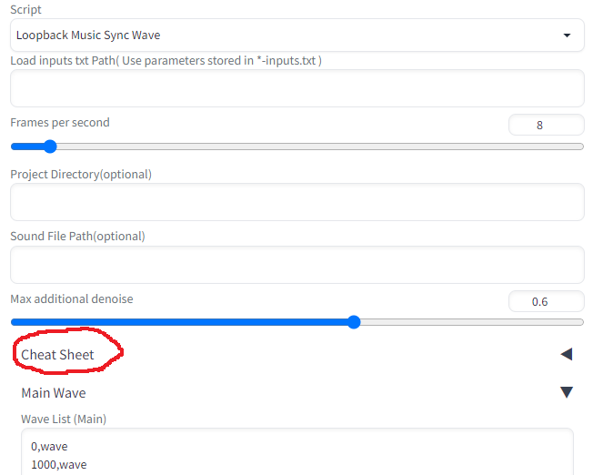
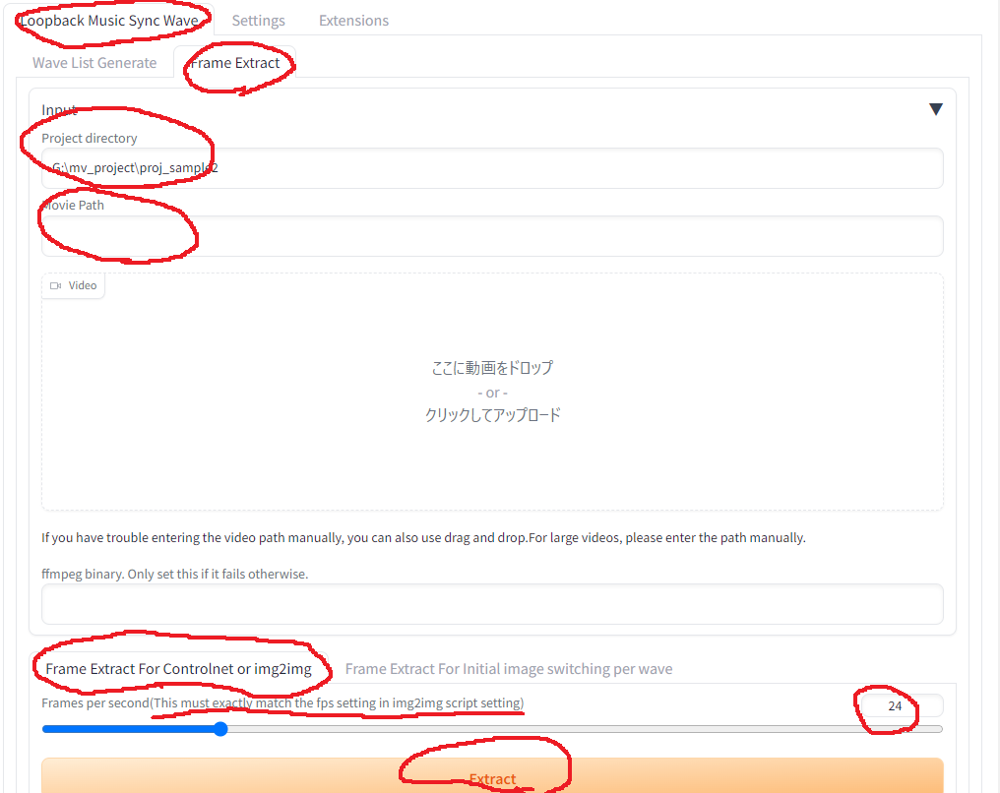
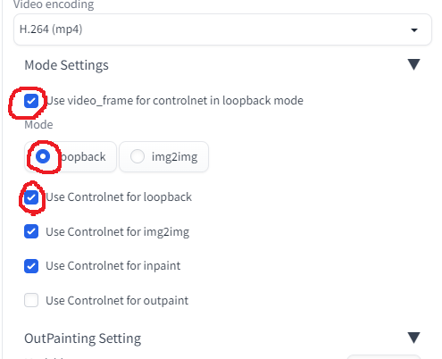

# sd_loopback_music_sync_wave

## Overview
#### AUTOMATIC1111 UI extension for creating videos using img2img.  
#### This extension was created based on [Loopback Wave Script](https://github.com/FizzleDorf/Loopback-Wave-for-A1111-Webui)  
#### The major changes are that the wave length can be set one by one in milliseconds and that wildcard can be used.  
#### In addition, I have added various @function.  

## Example
- The following sample is raw output of this extension.(The file was too large, so I compressed it.)  
#### sample 1  

<video controls src="https://user-images.githubusercontent.com/118420657/235941290-2708913c-16c0-4f3a-82db-7ab729ea7ea8.mp4" muted="false"></video>

 

#### sample 2  
- Loopback mode(default) + Controlnet(open pose)  
- All the parts except for the main prompt are taken from sample 1.  

<video controls src="https://user-images.githubusercontent.com/118420657/236166342-6b2457a0-7d4e-4dd5-9964-0d3293c8dc9c.mp4" muted="false"></video>

 

#### sample 3  
- img2img mode + Controlnet(open pose)  
- The setting is exactly the same as sample2 except mode is changed to img2img.  

<video controls src="https://user-images.githubusercontent.com/118420657/236167376-e914c244-c5fc-453d-9b20-32a80c53b9af.mp4" muted="false"></video>

 

## Installation  
- Use the Extensions tab of the webui to [Install from URL]  

 
 

## Basic Usage  
- Go to [txt2img] tab.  
- Generate some image. (I recommend to make with Euler a / 20 steps / cfg 7)  
- Press [Send to img2img] Button  
- Go to [img2img] tab.  
- Lower the [Denoising strength]. (I recommend 0.25)  
- Select [Loopback Music Sync Wave] in Script drop list  
- Copy the following text into the [Wave List (Main)]  
0,wave  
1000,wave  
2000,wave  
3000,wave  
3500,wave  
4000,wave  
4500,wave  
5000,end  
- Copy the following text into the [Extend Prompt (Main)]. The wildcards used below are those provided by default.  
-1::\_\_lb_vel_slow__  
-1::\_\_lb_zoom_wave__  
-1::\_\_lb_prompt_face__  
- Press [Generate]  
- (Default file output location, video encoding settings, etc. are the same as in the original script)  

 
 

## Advanced Usage  

### How to generate video synchronized to music  
TODO  
- in [Loopback Music Sync Wave] tab, you can automatically generate a wave list. You can also compare prompts and audio waveforms.  

 

### How to use SAM together
TODO

 

### How to replace the initial image in the middle of the process  
- The initial image can be replaced on a wave-by-wave basis.  
- Create an empty directory as a project directory and create a [video_frame_per_wave] directory in it.  
- In it, put a png file with the name of the index of the wave you want to correspond to. For example, if you have [project_dir/video_frame_per_wave/2.png], the image will be switched at the timing of the wave with index 2.   
- If the image contains png info, the prompt will also be overwritten.
- It might be interesting to make a video with images you picked up at random somewhere.  

 

### @#$function list  
- The list of functions and how to write the wave list are described in [Cheat Sheet].  

 

### img2img mode  
- As an added bonus, img2img mode is implemented. You can switch between loopback and img2img in [Mode Settings].
- The original frame required for img2img must be generated by the following procedure. (If you want to use controlnet in loopback mode as in sample2, you should also generate frames using this procedure.)  

 

### loopback + controlnet  
- First, configure the control net itself as you normally use it, set it to enable, then configure the preprocessor and mode settings  
- Specify the same path in [Project Directory(optional)] as specified in the frame creation procedure above.  
- Make the following settings in [Mode Settings]
- Generate  

 

### 

### Other Tips  
- If you specify the *-inputs.txt that is created at the same time as creating the video in [Load inputs txt Path], you can create the video again with the same input as last time  
- If you want to reuse only some of the inputs, open *-prompt.txt and copy only where you need it
- If you want to add more wildcards yourself,
Put them in [extensions/sd_loopback_music_sync_wave/wildcards]. If you are too lazy to make your own, you can pick them up at civitai.  
- If you want to make a video only for the first 5 seconds in the test, temporarily add "5000, end" to the wave list entered in [Wave List (Main)]  
- The unit of velocity for function parameters is the number of screens per second. For example, a speed of 1.0 in the x-axis direction means that if the screen moves at the same speed for one second, it will scroll one horizontal screen. In the case of rotation speed, it is the degree per second.  
- There are three ways to increase the resolution.  
A. Do img2img with a higher resolution from the beginning.  
B. Use [Upscale Settings].  
C. Upscale the generated video using an external tool.  
A is probably the best way to get the best results, but it also takes the most processing time.
- There are two ways to increase fps for smooth animation  
A. Put a larger value in [Frames per second]  
B. Interpolate with an external tool  
A is very effective, but the processing time will be proportionally longer.  
